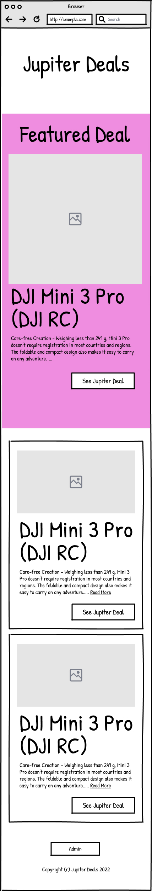

# JUPITER README

## PROJECT DESCRIPTION

Affliate marketing app designed to display and promote a list of product deals to the audience. The audience may view the products, see a brief description, a link to the product, the price, an image of the product, and the name of the product. The admin of the site will have a separate login to edit, post, and delete products.

## PROJECT MANAGER

Stephen Wong

## GROUP MEMBERS

- Matthew Studzinski
- Mauricio Alvarenga
- Yu Xiong
- Stephen Wong

## APP REQUIREMENTS

- RESTful API using technologies including Node, Express, and Mongoose that serves JSON
  - At least 1 User Model
  - RESTful architecture
  - CRUB App
- Front-end React App that makes request to the API

## MVP

- Mongo Atlas DB with a document of products.
- Front page of deals
  - More details (show more details when the description is too long)
  - Hero or Carousel (stretch) of the top deals
  - Product
    - Each product should have a category
    - Each product should have a Price
    - Each product should have a Title
    - Each product should have a Description
- Admin page to post, delete, edit products, and changed Hero

## STRETCH GOALS

- Search Bar feature
- Likes feature
- Admin user authentication feature
- Sign up for email notifications
- Tailwind library
- Threejs library
- Particlejs library
- Affiliate advertising banners

## MODELS

- Product Model

  - Title (String)
  - Original Price (Number)
  - Sale Price (Number)
  - Description (String)
  - Image URL (String)
  - Likes (Number)
  - Category (Array)
  - Hero (Boolean)

- User Model
  - Username (String)
  - Password (String)

## COMPONENTS

### Final Site

Pics removed for demo

### Admin Page

- Admin
- Admin Login
- List of products.
- Edit Modal

### Product Page

- Product Card
- Product Page
- Navigation
- Footer
- Header
- React Router Dom
- Top Deals Hero

## REQ RES CYCLE

## TECHNOLOGIES USED

Axios
React Material UI
React Router Dom
React Bootstrap
Heroku
MongoDB
Mongoose
Express
React
Puppeteer
Cheerio
Browserless

## PLANNING

### WIREFRAME

### PROJECT TRACKING

Project tracking was conducted on Clickup app. 

### PROJECT OBSTACLES
- Choosing the right library for carousol. 
- CSS generally difficult.
- Media queries are a challenge.
- Conflicts with design direction. 

### FUTURE PLANNED IMPLEMENTATIONS
- Update feel and look
- Fix scrapper
- Add Nav bar with categories
- User sign in for favorites and email alerts.
